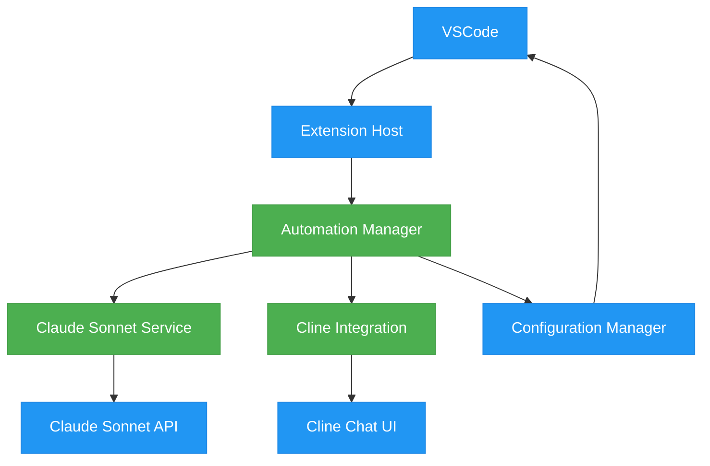
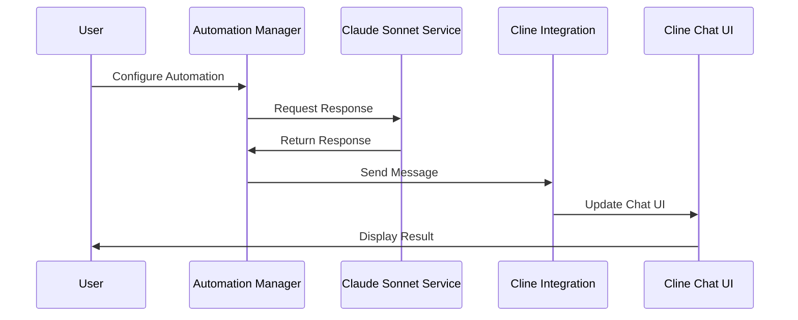

# Architectural Design 🏗️

## System Overview

### High-Level Architecture 🔍

!!! abstract "System Components"
    The following diagram shows the high-level architecture of the system:



### Component Flow 🔄

!!! note "Interaction Flow"
    This sequence diagram illustrates the typical flow of operations:



## Component Design 🎨

### Automation Manager 🎯

!!! info "Central Control Component"
    The Automation Manager serves as the core orchestrator for automated interactions.

#### Technical Stack
- 🔧 TypeScript
- 🔌 VSCode Extension API
- 📡 Event Emitter Pattern

#### APIs
- 🔄 Internal automation API
- ⚙️ Configuration API

#### Data Models

```typescript
interface AutomationConfig {
    triggers: AutomationTrigger[];
    rules: AutomationRule[];
    settings: AutomationSettings;
}

interface AutomationTrigger {
    id: string;
    type: TriggerType;
    condition: string;
    action: AutomationAction;
}
```

### Claude Sonnet Service 🤖

!!! info "AI Integration Service"
    Manages all interactions with the Claude Sonnet API.

#### Technical Stack
- 🔧 TypeScript
- 🌐 Axios for HTTP
- ⏱️ Rate limiting

#### APIs
- 🔌 Claude Sonnet REST API

#### Data Models

```typescript
interface SonnetRequest {
    prompt: string;
    options: SonnetOptions;
}

interface SonnetResponse {
    content: string;
    metadata: ResponseMetadata;
}
```

### Cline Integration 💬

!!! info "Chat UI Integration"
    Handles interaction with the Cline extension's chat interface.

#### Technical Stack
- 🔧 TypeScript
- 🔌 VSCode Extension API
- 📨 Message passing

#### APIs
- 🔌 Cline Extension API

#### Data Models

```typescript
interface ChatMessage {
    id: string;
    content: string;
    type: 'user' | 'assistant';
    timestamp: number;
}

interface ChatState {
    messages: ChatMessage[];
    status: ChatStatus;
}
```

## Directory Structure 📁

!!! example "Project Organization"
    ```bash
    vscode-claude-sonnet/
    ├── src/
    │   ├── automation/
    │   │   ├── manager.ts
    │   │   ├── triggers.ts
    │   │   └── rules.ts
    │   ├── services/
    │   │   ├── claude-sonnet.ts
    │   │   └── cline-integration.ts
    │   ├── config/
    │   │   ├── settings.ts
    │   │   └── validation.ts
    │   ├── utils/
    │   │   ├── rate-limiter.ts
    │   │   └── logger.ts
    │   └── extension.ts
    ├── test/
    │   ├── automation/
    │   ├── services/
    │   └── integration/
    ├── resources/
    │   └── icons/
    └── docs/
        ├── api/
        └── guides/
    ```

## Integration Points 🔌

### Claude Sonnet API

!!! warning "External Service Integration"
    - 🔑 Authentication via API key
    - ⏱️ Configurable rate limits
    - 🔒 HTTPS communication

#### Data Flow
1. Send prompt request
2. Receive AI response
3. Process and format response
4. Forward to Cline integration

### Cline Extension

!!! warning "Internal Extension Integration"
    - 🔌 Extension API integration
    - 📨 VSCode messaging system
    - 🖥️ UI state management

#### Data Flow
1. Receive formatted message
2. Update chat UI state
3. Handle user interactions
4. Maintain conversation context

## Security Considerations 🔒

### API Key Management

```typescript
class SecureStorage {
    private context: vscode.ExtensionContext;
    
    async storeApiKey(key: string): Promise<void> {
        await this.context.secrets.store('claude-sonnet-key', key);
    }
    
    async getApiKey(): Promise<string | undefined> {
        return await this.context.secrets.get('claude-sonnet-key');
    }
}
```

### Data Protection

!!! danger "Security Measures"
    - 🔒 HTTPS for all API communications
    - 🔑 Secure storage for sensitive data
    - ✅ Input validation and sanitization
    - ⏱️ Rate limiting and request throttling

## Error Handling ⚠️

### Strategy

```typescript
class ErrorHandler {
    static handle(error: Error): void {
        if (error instanceof ApiError) {
            // Handle API errors
            this.handleApiError(error);
        } else if (error instanceof ConfigError) {
            // Handle configuration errors
            this.handleConfigError(error);
        } else {
            // Handle general errors
            this.handleGeneralError(error);
        }
    }
}
```

## Performance Optimizations ⚡

!!! tip "Performance Measures"
    - 📥 Message queuing for rate limiting
    - 💾 Caching of frequent responses
    - 🔄 Lazy loading of components
    - 🧹 Resource cleanup on deactivation