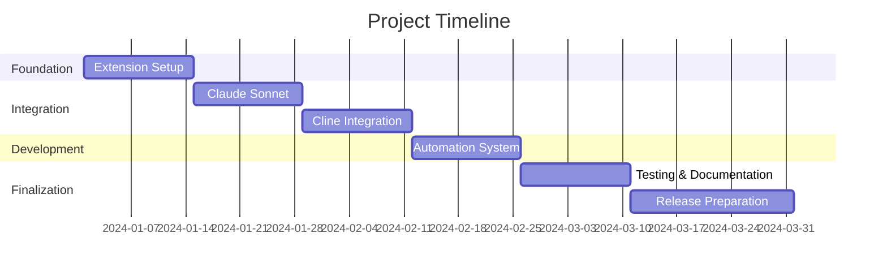

# Implementation Plan 📋

## Project Timeline 📅

!!! info "Project Duration"
    - 🎯 Start: 2024-01-01
    - 🏁 End: 2024-03-31

## Epics 🚀

### [EPIC-001] Extension Foundation
!!! abstract "Basic Setup"
    - 📝 **Description**: Set up VSCode extension structure and environment
    - ⭐ **Priority**: High
    - ⏱️ **Timeline**: Week 1-2
    - 🔄 **Dependencies**: None

### [EPIC-002] Claude Sonnet Integration
!!! abstract "AI Integration"
    - 📝 **Description**: Implement Claude Sonnet API integration
    - ⭐ **Priority**: High
    - ⏱️ **Timeline**: Week 2-4
    - 🔄 **Dependencies**: EPIC-001

### [EPIC-003] Cline Integration
!!! abstract "UI Integration"
    - 📝 **Description**: Develop Cline extension chat UI integration
    - ⭐ **Priority**: High
    - ⏱️ **Timeline**: Week 4-6
    - 🔄 **Dependencies**: EPIC-001

### [EPIC-004] Automation System
!!! abstract "Core System"
    - 📝 **Description**: Build automation system for interactions
    - ⭐ **Priority**: High
    - ⏱️ **Timeline**: Week 6-8
    - 🔄 **Dependencies**: EPIC-002, EPIC-003

### [EPIC-005] Testing & Refinement
!!! abstract "Quality Assurance"
    - 📝 **Description**: Testing and optimization
    - ⭐ **Priority**: Medium
    - ⏱️ **Timeline**: Week 8-10
    - 🔄 **Dependencies**: EPIC-004

### [EPIC-006] Documentation & Release
!!! abstract "Release Preparation"
    - 📝 **Description**: Documentation and marketplace release
    - ⭐ **Priority**: Medium
    - ⏱️ **Timeline**: Week 10-12
    - 🔄 **Dependencies**: EPIC-005

## Sprint Details 🏃

### [SPRINT-001] Extension Setup
!!! note "Initial Sprint"
    **Duration**: 2024-01-01 - 2024-01-14

#### Goals
- ⚙️ Set up development environment
- 🏗️ Create basic extension structure
- ⚡ Implement configuration system

#### Stories

??? example "STORY-001: Development Environment Setup"
    - **Tasks**:
        1. Install development tools
        2. Generate extension scaffold
        3. Configure TypeScript and ESLint
    - **Estimates**: 2 days
    - **Dependencies**: None

??? example "STORY-002: Basic Extension Structure"
    - **Tasks**:
        1. Implement extension activation
        2. Add basic commands
        3. Create settings schema
    - **Estimates**: 3 days
    - **Dependencies**: STORY-001

### [SPRINT-002] Claude Sonnet Integration
!!! note "API Integration Sprint"
    **Duration**: 2024-01-15 - 2024-01-28

#### Goals
- 🔌 Implement Claude Sonnet API client
- 🔑 Add authentication handling
- 🔄 Implement response processing

#### Stories

??? example "STORY-003: API Client Implementation"
    - **Tasks**:
        1. Create API client class
        2. Implement authentication
        3. Add error handling
    - **Estimates**: 4 days
    - **Dependencies**: EPIC-001

### [SPRINT-003] Cline Integration
!!! note "UI Integration Sprint"
    **Duration**: 2024-01-29 - 2024-02-11

#### Goals
- 🔌 Implement Cline extension integration
- 💬 Add chat UI interaction
- 📨 Handle message passing

#### Stories

??? example "STORY-004: Chat UI Integration"
    - **Tasks**:
        1. Implement message sending
        2. Add UI state management
        3. Handle chat history
    - **Estimates**: 5 days
    - **Dependencies**: EPIC-002

### [SPRINT-004] Automation System
!!! note "Core Development Sprint"
    **Duration**: 2024-02-12 - 2024-02-25

#### Goals
- 🎯 Build automation manager
- ⚡ Implement triggers system
- 📋 Add automation rules

#### Stories

??? example "STORY-005: Automation Manager"
    - **Tasks**:
        1. Create automation manager
        2. Implement trigger system
        3. Add rule processing
    - **Estimates**: 6 days
    - **Dependencies**: EPIC-003

### [SPRINT-005] Testing & Documentation
!!! note "Quality Sprint"
    **Duration**: 2024-02-26 - 2024-03-10

#### Goals
- ✅ Implement comprehensive tests
- 📚 Create documentation
- ⚡ Optimize performance

#### Stories

??? example "STORY-006: Test Implementation"
    - **Tasks**:
        1. Create unit tests
        2. Add integration tests
        3. Implement E2E tests
    - **Estimates**: 5 days
    - **Dependencies**: EPIC-004

### [SPRINT-006] Release Preparation
!!! note "Final Sprint"
    **Duration**: 2024-03-11 - 2024-03-31

#### Goals
- 📦 Prepare for marketplace release
- 📚 Create release documentation
- 🚀 Submit to marketplace

#### Stories

??? example "STORY-007: Marketplace Submission"
    - **Tasks**:
        1. Package extension
        2. Create marketplace listing
        3. Submit for review
    - **Estimates**: 4 days
    - **Dependencies**: EPIC-005

## Risk Management ⚠️

### Identified Risks

!!! danger "High Impact Risks"
    | Risk | Impact | Probability | Mitigation |
    |------|--------|-------------|------------|
    | API Changes | High | Medium | Version checking, graceful degradation |
    | Integration Conflicts | High | Medium | Thorough version testing |
    | Performance Issues | Medium | Low | Regular optimization |

## Quality Gates 🎯

!!! success "Quality Criteria"
    1. **Code Quality**
        - ✅ All tests passing
        - 📊 Code coverage > 80%
        - 🔒 No critical security issues

    2. **Performance**
        - ⚡ Startup time < 1s
        - 🔄 Response time < 2s
        - 💾 Memory usage < 100MB

    3. **Documentation**
        - 📚 API documentation complete
        - 📖 User guide updated
        - 📋 Release notes prepared