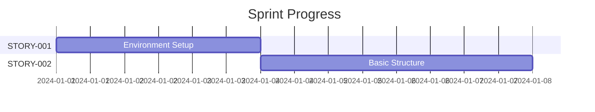
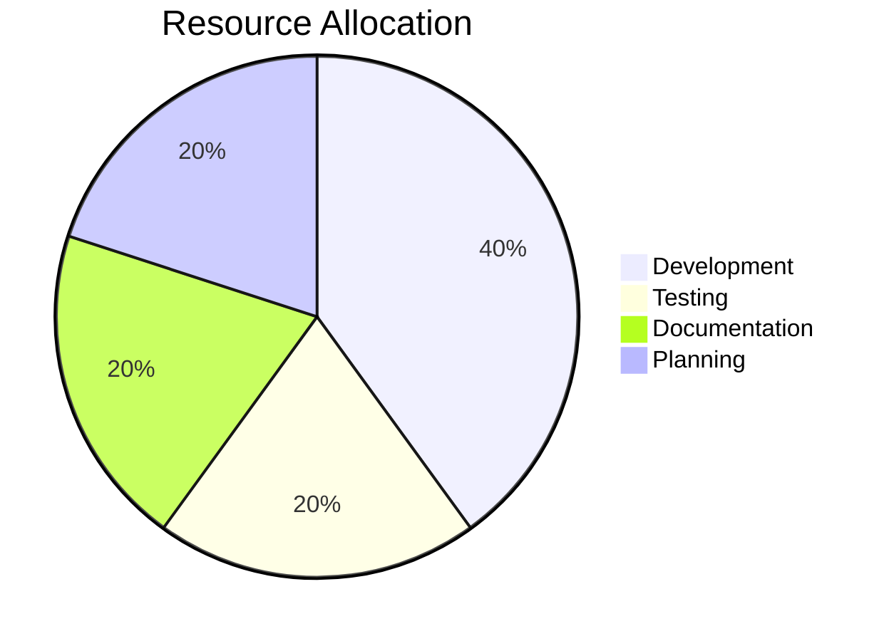

# Progress Log 📊

## Sprint Tracking 🏃‍♂️

### [SPRINT-001] Extension Setup

!!! info "Sprint Status"
    - 📅 **Start Date**: 2024-01-01
    - 📅 **End Date**: 2024-01-14
    - 🚦 **Status**: Not Started
    - 💰 **OpenRouter Credits**:
        - Opening Balance: TBD
        - Closing Balance: TBD
        - Cost: TBD

#### Planned Stories

??? abstract "STORY-001: Development Environment Setup"
    - 🚦 **Status**: Not Started
    - 📅 **Estimated Start**: 2024-01-01
    - 🔄 **Dependencies**: None
    
    **Tasks Pending**:
    - [ ] [TASK-001] Install development tools
    - [ ] [TASK-002] Generate extension scaffold
    - [ ] [TASK-003] Configure TypeScript and ESLint

??? abstract "STORY-002: Basic Extension Structure"
    - 🚦 **Status**: Not Started
    - 📅 **Estimated Start**: 2024-01-04
    - 🔄 **Dependencies**: STORY-001
    
    **Tasks Pending**:
    - [ ] [TASK-004] Implement extension activation
    - [ ] [TASK-005] Add basic commands
    - [ ] [TASK-006] Create settings schema

## Event Log 📝

### Project Initialization

!!! note "2024-01-01: Project Kickoff"
    - ✅ Created project documentation structure
    - ✅ Defined initial architecture and requirements
    - ✅ Set up project timeline and milestones

### Repository Setup

!!! warning "2024-01-01: Initial Repository Creation"
    **Status**: Planned
    
    **Tasks**:
    - [ ] Create GitHub repository
    - [ ] Set up branch protection rules
    - [ ] Configure CI/CD pipeline

### Issues

!!! bug "2024-01-01: Initial Project Setup Tasks"
    - 🚦 **Status**: To Be Created
    - 📋 **Type**: Setup
    - ⭐ **Priority**: High
    
    **Tasks**:
    - [ ] Repository initialization
    - [ ] Development environment setup
    - [ ] Initial extension scaffolding

## Resource Tracking 📊

### Development Resources

!!! example "Tools & Environment"
    | Resource | Status | Requirements |
    |----------|---------|--------------|
    | VSCode Extension Tools | To Be Installed | Latest stable |
    | Claude Sonnet API | Access Pending | API key setup |
    | Cline Extension API | Integration Planning | Extension messaging setup |

## Progress Overview 📈

## Notes 📌

!!! tip "Current Status"
    - ✅ Project documentation structure completed
    - ✅ Initial architecture and requirements defined
    - ✅ Implementation plan created
    - 🔄 Ready to begin development phase

## Next Steps 🎯

1. 📂 Create GitHub repository
2. ⚙️ Set up development environment
3. 🏗️ Generate extension scaffold
4. 🚀 Begin implementation of STORY-001

## Blockers 🚫

!!! success "No Current Blockers"
    No blocking issues currently identified

## Risks ⚠️

### 1. API Integration Complexity
!!! warning "Risk Details"
    - 🚦 **Status**: Monitoring
    - 🛡️ **Mitigation**: Early prototyping planned
    - 📊 **Impact**: High
    - 🎲 **Probability**: Medium

### 2. Performance Optimization
!!! warning "Risk Details"
    - 🚦 **Status**: To Be Addressed
    - 🛡️ **Mitigation**: Regular testing during development
    - 📊 **Impact**: Medium
    - 🎲 **Probability**: Low

## Resource Utilization 📊

## Sprint Burndown 📉

!!! note "Sprint Metrics"
    - 📊 **Story Points**: 0/13
    - ⏱️ **Time Elapsed**: 0%
    - 🎯 **Completion**: 0%
    - 🚀 **Velocity**: TBD