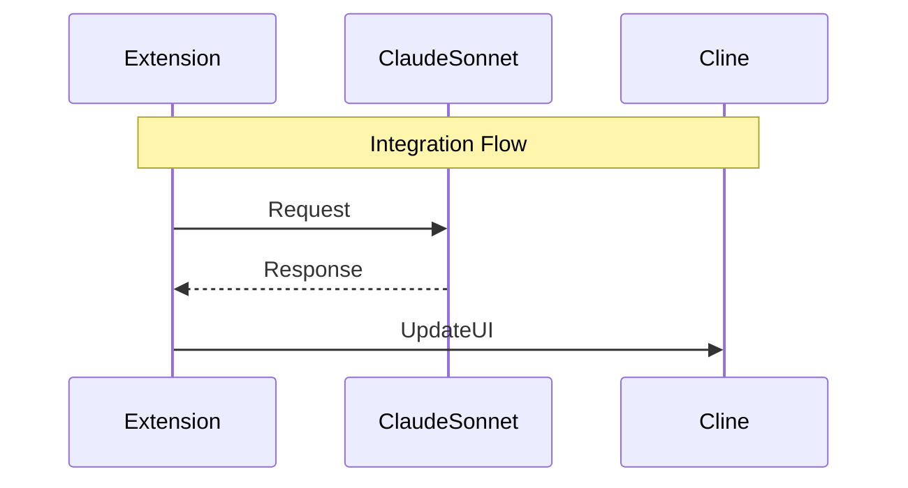
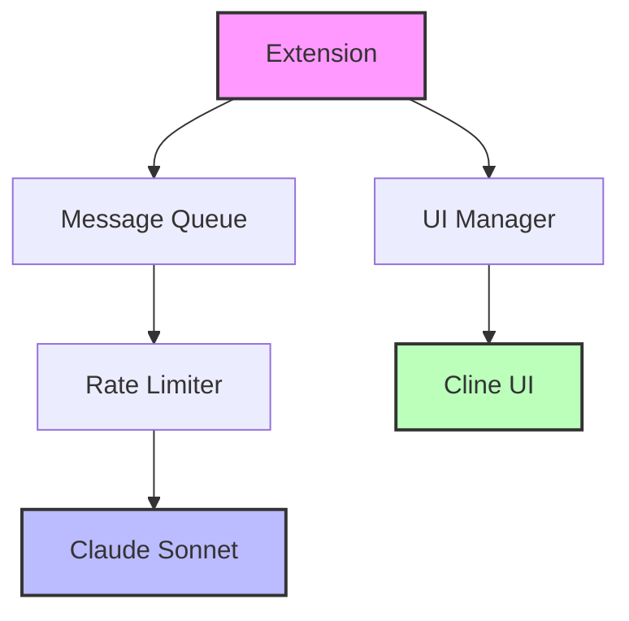

# Development Scratchpad 📝

## Quick Notes 📌

!!! note "Latest Updates [2024-01-01]"
    - ✅ Initial project setup complete with KRM structure
    - 🔍 Need to research VSCode extension messaging system
    - ⚡ Consider rate limiting strategy for Claude Sonnet API
    - 📋 TODO: Document Claude Sonnet API authentication flow
    - 🔍 TODO: Research Cline extension's public API surface

## Technical Observations 🔬

### VSCode Extension API

!!! info "Extension Activation"
    - 🔍 **Observation**: Need to understand extension activation events
    - 📊 **Impact**: Affects extension loading and Cline interaction
    - 💡 **Solution Ideas**:
        - Use `*` activation event initially
        - Optimize to specific Cline events
        - Implement workspace state persistence

### Claude Sonnet Integration

!!! warning "Rate Limiting"
    - 🔍 **Observation**: Need to handle API rate limits gracefully
    - 📊 **Impact**: Critical for user experience
    - 💡 **Solution Ideas**:
        - Token bucket algorithm
        - Request queuing system
        - User feedback mechanisms

### Cline Integration

!!! info "Message Protocol"
    - 🔍 **Observation**: Need to identify Cline's messaging protocol
    - 📊 **Impact**: Critical for chat UI integration
    - 💡 **Solution Ideas**:
        - Analyze Cline's source code
        - Implement message queue
        - Add fallback mechanisms

## Task Checklist ✅

- [ ] Set up development environment
- [ ] Create Jest test suite
- [ ] Document API authentication
- [ ] Research Cline APIs
- [ ] Plan rate limiting
- [ ] Create automation configs
- [ ] Set up error tracking

## Reference Links 🔗

!!! tip "Documentation"
    - [VSCode Extension API](https://code.visualstudio.com/api)
    - [Claude Sonnet Documentation](TBD)
    - [Roo Cline Extension](TBD)
    - [VSCode Extension Testing](https://code.visualstudio.com/api/working-with-extensions/testing-extension)
    - [TypeScript Guidelines](https://github.com/microsoft/TypeScript/wiki/Coding-guidelines)

## Implementation Notes 💻

### Authentication Flow

```typescript
/**
 * Claude Sonnet Authentication Flow
 * @todo Implement secure key storage
 * @todo Add key validation
 * @todo Handle refresh/rotation
 */
async function authenticateClaudeSonnet() {
    // Implementation pending
}
```

### Message Queue System

```typescript
/**
 * Message Queue Interface
 */
interface MessageQueue {
    pending: Message[];
    processing: Message | null;
    rateLimiter: RateLimiter;
}
```

### Integration Flow



## Performance Considerations ⚡

!!! warning "Performance Monitoring"
    - 📊 Monitor memory usage
    - 📦 Implement message batching
    - 🔍 Watch for memory leaks
    - 🧹 Implement cleanup routines

## Security Notes 🔒

!!! danger "Security Measures"
    - 🔑 Store API keys securely
    - 🔍 Sanitize all inputs
    - 🔒 Secure communication
    - ✅ Validate automation rules

## Future Ideas 🚀

!!! example "Future Enhancements"
    | Feature | Priority | Complexity |
    |---------|----------|------------|
    | Custom Templates | Medium | High |
    | Rule Sharing | Low | Medium |
    | Analytics Dashboard | Medium | High |
    | Multiple Profiles | Low | Medium |
    | Context Management | High | High |

## Architecture Notes 🏗️

### Component Interaction



## API Design Patterns 📐

!!! abstract "Design Considerations"
    ```typescript
    // Event-driven architecture
    interface AutomationEvent {
        type: string;
        payload: unknown;
        timestamp: number;
    }

    // Observer pattern for UI updates
    interface UIObserver {
        onUpdate(message: ChatMessage): void;
        onError(error: Error): void;
    }
    ```

## Testing Strategy 🧪

!!! tip "Test Categories"
    1. **Unit Tests**
        - Service mocking
        - State management
        - Event handling
    
    2. **Integration Tests**
        - API communication
        - Message flow
        - UI updates
    
    3. **E2E Tests**
        - Full automation flows
        - Error scenarios
        - Performance metrics