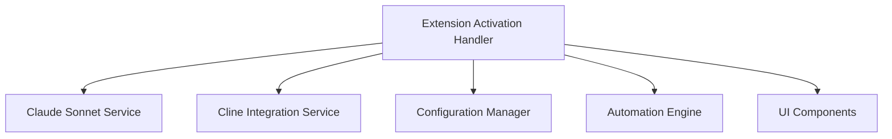

# Technical Requirements

## Development Stack 🛠️

### Programming Languages

!!! info "TypeScript 5.x"
    Primary development language with strict requirements

| Requirement | Description |
|------------|-------------|
| Mode | Strict TypeScript |
| Linting | ESLint for VSCode extensions |
| Type Safety | Strict checking for API integrations |
| Style Guide | Microsoft TypeScript Guidelines |

### Frameworks & Libraries 📚

#### VSCode Extension API
!!! abstract "Core Extension Development"
    - Extension manifest (package.json) configuration
    - VSCode API integration
    - Extension lifecycle management

#### Claude Sonnet API Client
!!! abstract "AI Integration"
    - API authentication
    - Rate limiting
    - Response handling

#### Cline Extension API
!!! abstract "UI Integration"
    - Extension messaging
    - State management
    - UI interaction

## Architecture Requirements 🏗️

### System Architecture

!!! tip "Component-Based Architecture"
    Following VSCode extension patterns and best practices

#### Key Components



#### Integration Points
- 🔌 VSCode Extension API
- 🤖 Claude Sonnet API
- 💬 Cline Extension API
- ⚙️ VSCode Settings API
- 🎮 VSCode Commands API

### Infrastructure 🌐

#### Hosting Requirements
- 📦 VSCode Extension Marketplace deployment
- 📂 GitHub repository hosting
- 🔄 CI/CD pipeline

#### Scalability Needs
- ⚡ Efficient message handling
- 💻 Resource-conscious operation
- 🔄 Concurrent request management

#### Security Requirements
- 🔑 Secure API key storage
- 🔒 Data encryption at rest
- 🛡️ Secure communication channels

## Development Tools 🔧

### Required Tools

!!! note "Core Development Tools"

    | Tool | Version | Purpose |
    |------|---------|----------|
    | Visual Studio Code | Latest stable | Development environment |
    | Node.js | v18.x+ | Runtime environment |
    | vsce | Latest | Extension packaging |
    | ESLint | Latest | Code quality |

### Development Environment

!!! example "Setup Steps"
    1. Clone repository
    2. Install dependencies (`npm install`)
    3. Configure VSCode extension debugging
    4. Set up API keys

Required Configurations:
- 🔧 VSCode extension development settings
- 🐛 Debug launch configurations
- 🔌 API endpoint configurations
- 🧪 Test environment setup

## Conventions & Standards 📋

### Coding Standards

!!! warning "Style Requirements"
    - ESLint configuration
    - Prettier for formatting
    - TypeScript strict mode

Documentation Requirements:
- 📝 JSDoc comments for public APIs
- 📘 README.md maintenance
- 📋 CHANGELOG.md updates
- 📚 API documentation

Testing Requirements:
- ✅ Unit tests with Jest
- 🔄 Integration tests
- 🎯 E2E tests for critical paths
- 📊 Minimum 80% coverage

### Version Control

!!! info "Branch Strategy"
    ```mermaid
    gitGraph
        commit
        branch develop
        commit
        branch feature
        commit
        checkout develop
        merge feature
        checkout main
        merge develop
    ```

#### Commit Conventions
- 📝 Conventional Commits format
- 🏷️ Semantic versioning
- ✍️ Signed commits required

#### PR Requirements
- 📋 Template usage
- 👥 Review by maintainer
- ✅ All tests passing
- 🎯 No linting errors
- 🔄 Up-to-date with base

## Performance Requirements ⚡

!!! success "Performance Targets"
    | Metric | Target |
    |--------|--------|
    | Startup time | < 1s |
    | Command execution | < 500ms |
    | Memory usage | < 100MB |
    | CPU usage | < 10% idle |
    | API response | < 2s |

## Testing Strategy 🧪

### Testing Levels

!!! abstract "Unit Testing"
    - Jest framework
    - Mock external dependencies
    - Test isolated components

!!! abstract "Integration Testing"
    - Test API integrations
    - Test extension activation
    - Test configuration handling

!!! abstract "E2E Testing"
    - VSCode extension testing framework
    - Automated UI testing
    - Cross-version compatibility

## Deployment Requirements 🚀

### Extension Packaging
- 📦 `vsce package` command
- 📂 Include necessary assets
- 🗑️ Exclude development files

### Marketplace Submission
- 📝 Complete metadata
- 🖼️ Screenshots and documentation
- 📜 Version history

### Release Process
1. Version bump
2. CHANGELOG update
3. Tag creation
4. GitHub release
5. Marketplace publication