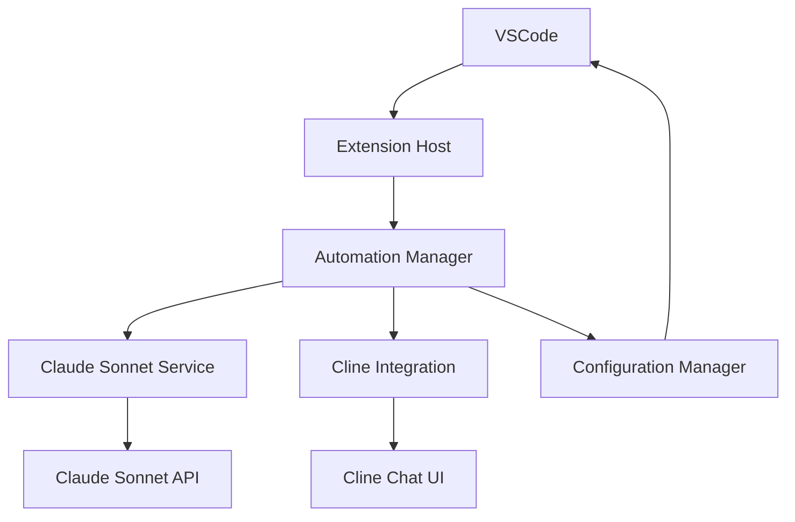
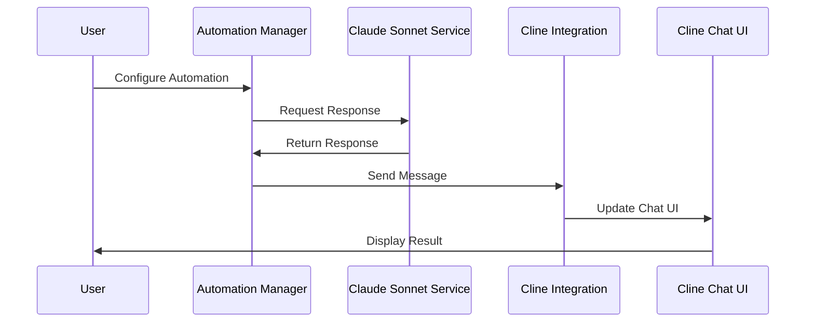

# Architectural Design

## System Overview
### High-Level Architecture


### Component Flow


## Component Design
### Automation Manager
#### Purpose
Central component managing automated interactions between Claude Sonnet and Cline.

#### Technical Specifications
- Technology stack:
  - TypeScript
  - VSCode Extension API
  - Event Emitter Pattern
- APIs:
  - Internal automation API
  - Configuration API
- Data models:
```typescript
interface AutomationConfig {
    triggers: AutomationTrigger[];
    rules: AutomationRule[];
    settings: AutomationSettings;
}

interface AutomationTrigger {
    id: string;
    type: TriggerType;
    condition: string;
    action: AutomationAction;
}
```

### Claude Sonnet Service
#### Purpose
Handles all interactions with the Claude Sonnet API.

#### Technical Specifications
- Technology stack:
  - TypeScript
  - Axios for HTTP
  - Rate limiting
- APIs:
  - Claude Sonnet REST API
- Data models:
```typescript
interface SonnetRequest {
    prompt: string;
    options: SonnetOptions;
}

interface SonnetResponse {
    content: string;
    metadata: ResponseMetadata;
}
```

### Cline Integration
#### Purpose
Manages interaction with the Cline extension's chat UI.

#### Technical Specifications
- Technology stack:
  - TypeScript
  - VSCode Extension API
  - Message passing
- APIs:
  - Cline Extension API
- Data models:
```typescript
interface ChatMessage {
    id: string;
    content: string;
    type: 'user' | 'assistant';
    timestamp: number;
}

interface ChatState {
    messages: ChatMessage[];
    status: ChatStatus;
}
```

## Directory Structure
```bash
vscode-claude-sonnet/
├── src/
│   ├── automation/
│   │   ├── manager.ts
│   │   ├── triggers.ts
│   │   └── rules.ts
│   ├── services/
│   │   ├── claude-sonnet.ts
│   │   └── cline-integration.ts
│   ├── config/
│   │   ├── settings.ts
│   │   └── validation.ts
│   ├── utils/
│   │   ├── rate-limiter.ts
│   │   └── logger.ts
│   └── extension.ts
├── test/
│   ├── automation/
│   ├── services/
│   └── integration/
├── resources/
│   └── icons/
└── docs/
    ├── api/
    └── guides/
```

## Integration Points
### Claude Sonnet API
- System: Claude Sonnet AI Service
  - Integration method: REST API
  - Authentication: API key
  - Rate limiting: Configurable limits
  - Data flow:
    1. Send prompt request
    2. Receive AI response
    3. Process and format response
    4. Forward to Cline integration

### Cline Extension
- System: Roo Cline VSCode Extension
  - Integration method: Extension API
  - Message passing: VSCode extension messaging
  - UI interaction: Chat interface updates
  - Data flow:
    1. Receive formatted message
    2. Update chat UI state
    3. Handle user interactions
    4. Maintain conversation context

## Security Considerations
### API Key Management
```typescript
class SecureStorage {
    private context: vscode.ExtensionContext;
    
    async storeApiKey(key: string): Promise<void> {
        await this.context.secrets.store('claude-sonnet-key', key);
    }
    
    async getApiKey(): Promise<string | undefined> {
        return await this.context.secrets.get('claude-sonnet-key');
    }
}
```

### Data Protection
- All API communications over HTTPS
- Secure storage for sensitive data
- Input validation and sanitization
- Rate limiting and request throttling

## Error Handling
### Strategy
```typescript
class ErrorHandler {
    static handle(error: Error): void {
        if (error instanceof ApiError) {
            // Handle API errors
            this.handleApiError(error);
        } else if (error instanceof ConfigError) {
            // Handle configuration errors
            this.handleConfigError(error);
        } else {
            // Handle general errors
            this.handleGeneralError(error);
        }
    }
}
```

## Performance Optimizations
- Message queuing for rate limiting
- Caching of frequent responses
- Lazy loading of components
- Resource cleanup on deactivation